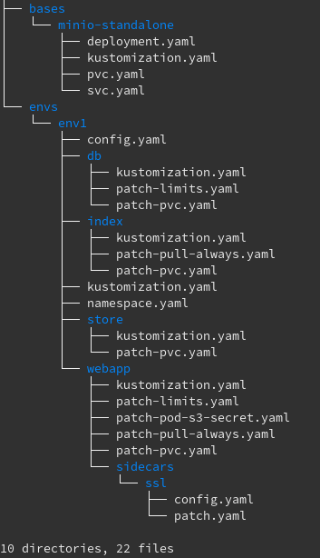

==================
Day 1 - Deployment
==================

.. toctree::
    :maxdepth: 2
    :caption: Contents:
    :hidden:

    ./config
    ./secrets
    ./resources
    ./storage
    ./provider-hints
    ./init-deploy
    ./job-bootstrap

Once you start building your own installation beyond ephemeral demo or
development purposes, you should take some time to prepare and successfully
roll out your deployment.

---------------------------
Guided Deployment Checklist
---------------------------

We provide you with this little checklist of topics and aspects to consider
while preparing your setup.

1. Pick your poison
-------------------

If you never touched a commandline, never thought about why using cloud
infrastructure might be a good idea: maybe you should stick with the old,
but paved and solid ways of installing complex applications like Dataverse.

Keen to learn new technology? Be part of the future? Want to streamline
CI/CD and your application? *Continue*.

2. Install necessary tools
--------------------------

You will at least need:

- | `kubectl`_, at least version 1.14
  | This will be your main tool for all operations in your installation.
- | `git`_ (or another VCS)
  | Your tool of choice to do revision control for your deployment objects.
    Using such tools is *lege artis*.

Depending on your use-case and targeted environment that might be just it.
If something else is necessary, it'll be documented in its respective documentation part.

.. hint::
  Please be aware that this project relies on the use of `Kustomize <http://kustomize.io>`_
  and does **not** provide a `Helm Chart <http://helm.sh>`_ (very different
  templated approach) **nor** an `Operator <https://operatorhub.io>`_ (to be done
  in the future, see :issue:`182`). Pull requests welcome, please get in touch.

3. Grasp some knowledge
-----------------------

If you never used Kubernetes before, but want to deploy to production, you
definitely should be reading some docs first. Some starting points:

- https://kubernetes.io/docs/tutorials/kubernetes-basics/
- https://ramitsurana.github.io/awesome-kubernetes
- https://kubernetes-on-aws.readthedocs.io/en/latest/admin-guide/kubernetes-in-production.html

4. Grab a cluster
-----------------

You'll need a running and fully configured Kubernetes cluster.

- | Local options:
  | These aren't necessarily meant for production, but might serve you well for
  | testing and maybe staging environments.

  - `k3s <https://k3s.io>`_
  - `minikube <https://kubernetes.io/docs/setup/learning-environment/minikube/>`_
  - `microk8s <https://microk8s.io>`_
  - `kind <https://kind.sigs.k8s.io/>`_

- Deploy your own (production) cluster. Many tools to choose from. Examples:

  - `k3s <https://k3s.io>`_ (+1 for small installations)
  - `kops <https://kubernetes.io/docs/setup/production-environment/tools/kops/>`_
  - `kubespray <https://kubernetes.io/docs/setup/production-environment/tools/kubespray/>`_
  - `Rancher <https://rancher.com/products/rancher>`_
  - `VMWare vSphere 7+ <https://docs.vmware.com/en/VMware-vSphere/7.0/vmware-vsphere-with-kubernetes/GUID-152BE7D2-E227-4DAA-B527-557B564D9718.html>`_

- Use a managed solution to avoid maintenance burden for the infrastructure.

  Many universities and research institutes already offer managed Kubernetes
  clusters for scientific use.

  Some examples by commercial companies:

  - Google: `GKE <https://cloud.google.com/kubernetes-engine>`_
  - Microsoft: `Azure AKS <https://azure.microsoft.com/services/kubernetes-service>`_
  - Amazon: `AWS EKS <https://aws.amazon.com/de/eks>`_
  - RedHat: `OpenShift <https://www.openshift.com>`_

  Please note there is an extensible collection of hints for some of these
  cloud providers at the :doc:`provider-hints` page.

5. Choose persistent identifiers
--------------------------------

When you want to register datasets and/or files in your deployment to
DataCite, EZID or similar, you will need active accounts. Be sure to have
access credentials around. As an alternative, you might want to use the FAKE provider.

.. seealso::

  For more information on Dataverses supported providers:

  - `Installation Guide: Persistent Identifiers and Publishing Datasets <http://guides.dataverse.org/en/4.20/installation/config.html#persistent-identifiers-and-publishing-datasets>`_
  - `Installation Guide: Configuration Option :DoiProvider <http://guides.dataverse.org/en/4.20/installation/config.html#doiprovider>`_

6. Build bases and environment overlays
---------------------------------------

Create an empty repository for your Kubernetes files and add a base layout.
A skeleton is available for you convenience to have a copy-paste starter
in ``personas/prod-skel``:

You should make a copy of env1 for both your production and testing environment.
Depending on your installation, it might make sense to create your own base.

.. tip::
  The skeleton already provides and example how to add Minio as S3 object store
  and add a custom SSL termination endpoint, but lacks an ``Ingress`` object.
  All of this needs to be adapted in the next step, depending on your cluster
  and necessities.

7. Configure and deploy
-----------------------

You now need to change all :doc:`config`, :doc:`limits <resources>`,
:doc:`storage classes <storage>`, etc. depending on your particular deployment.

Make sure to create all the :doc:`secrets` and match names between them.

Once you're done, DEPLOY! :-)

.. code-block:: shell

  kubectl apply -k envs/env1

When deployment is ready, you have to run the one-time :doc:`job-bootstrap`.

.. _kubectl: https://kubernetes.io/docs/tasks/tools/install-kubectl
.. _git: https://git-scm.com/downloads
