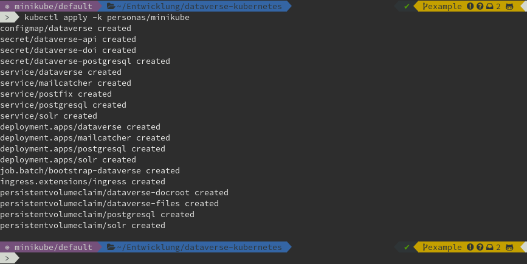
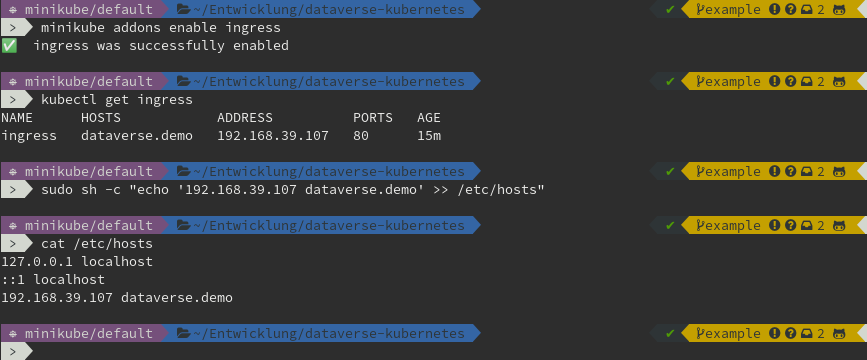
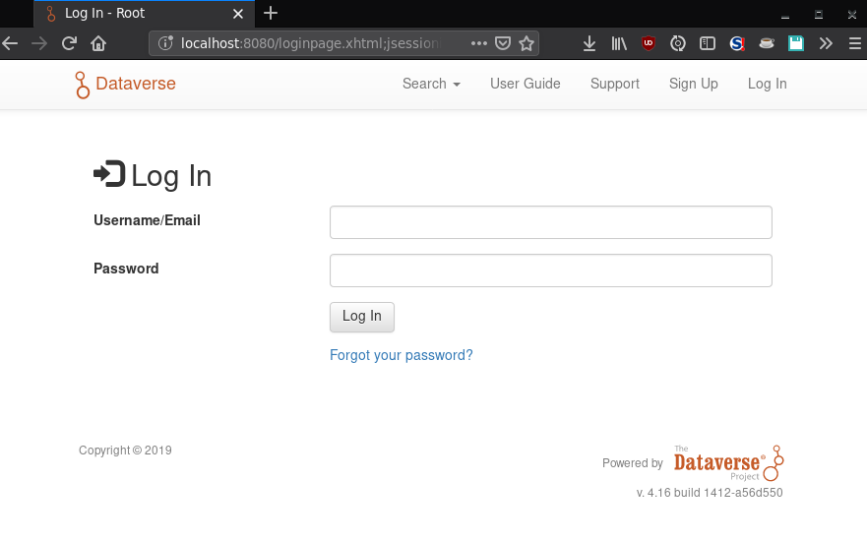

========================
Using *minikube* persona
========================

This persona will setup a demo installation with an almost vanilla approach
(not many tweaks necessary).

Start with setup of *minikube* VM
---------------------------------

Please ensure you have a working `Minikube <https://kubernetes.io/docs/setup/minikube>`_
installation or follow the `upstream instructions <https://kubernetes.io/docs/setup/learning-environment/minikube/#installation>`_
to get you started.

Booting your *minikube* K8s cluster:

.. code-block:: shell

  minikube start --memory=4096

.. image:: img/minikube-setup.png

.. important::
  Please provide at least 4 GB of RAM for the Minikube VM, as Dataverse will
  use **a lot** of RAM during deployment and at least 1024 MB when idle.
  Remember: this is a VM, so you should have at least 8 GB available in your hardware.

.. note::
  There have been mentions of a OOM-killed API Server on Windows using VirtualBox.
  When this happens, please delete and start over with 8 GB memory: ``--memory=8192``

Deploy Dataverse Demo
---------------------

Now let's create some resources with a habit of "fire'n'forget" (at least till
its ready) to create a demo:

.. code-block:: shell

  kubectl apply -k personas/minikube

You can check the status of the containers and the bootstrapping job from
the output of `kubectl get pods,jobs` and `kubectl logs`. It's gonna take a while...

.. image:: img/minikube-done.png

Done! To access your new deployment, see below for two different options.

Make Dataverse reachable via browser
------------------------------------

While you wait for the deployment to happen, you can think about your two options
to make Dataverse reachable from your browser: 1) use ``Ingress`` or 2) use
``kubectl port-forward``. See below.

Using ``Ingress`` access
^^^^^^^^^^^^^^^^^^^^^^^^

Add the `Ingress` IP address to your `/etc/hosts`:

.. code-block:: shell

  minikube addons enable ingress
  # wait for about 1 minute...
  kubectl get ingress

Take a note of the IP address (it might take a while till it appears, try again)
and add it to ``/etc/hosts``, replacing ``XXX.XXX.XXX.XXX`` with it:

.. code-block:: hosts

  XXX.XXX.XXX.XXX dataverse.demo

As soon as the deployment finished, you can reach your freshly baked Dataverse
demo via your browser at http://dataverse.demo.

.. image:: img/dataverse-dataversedemo.png

.. hint::

  Default login for this demo is ``dataverseAdmin:admin1``. See :doc:`/day1/secrets`.

Using ``kubectl port-forward``
^^^^^^^^^^^^^^^^^^^^^^^^^^^^^^

When you cannot change your ``/etc/hosts`` file, if Minikube is running remote
or for other reasons, you can always use the ``kubectl`` builtin reverse proxy:

.. code-block:: shell

  kubectl port-forward service/dataverse 8080:8080

.. image:: img/minikube-portfwd-8080.png

.. important::

  You will need to keep this running as long as you want to access the app.
  This command has the advantage to work in all cases, remotely or not,
  as long as you have access to the K8s API server.

Now access your freshly baked Dataverse demo via your browser at http://localhost:8080.

.. hint::

  Default login for this demo is ``dataverseAdmin:admin1``. See :doc:`/day1/secrets`.

A word on deployment times
--------------------------

On a 2016 laptop with

- 16 GB RAM,
- SATA SSD,
- Intel Core i5-6300U and
- a fairly fast internet connection for image pulling

it takes about **6 to 8 minutes** from zero to hero, not including installation time
for minikube, VirtualBox or kubectl. See also timestamps above.
