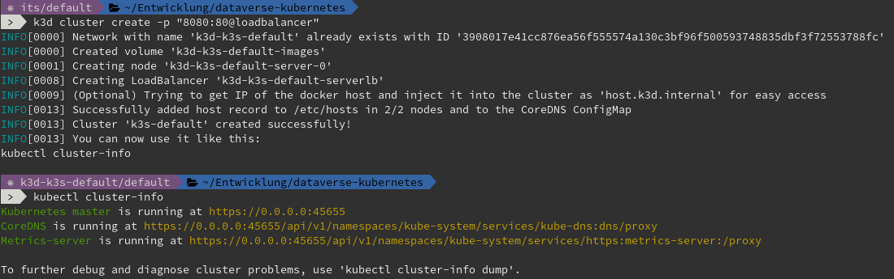
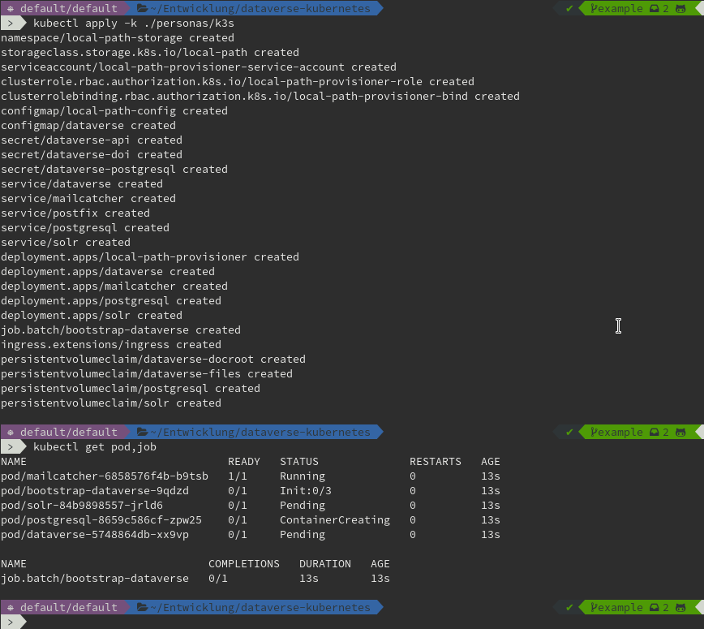
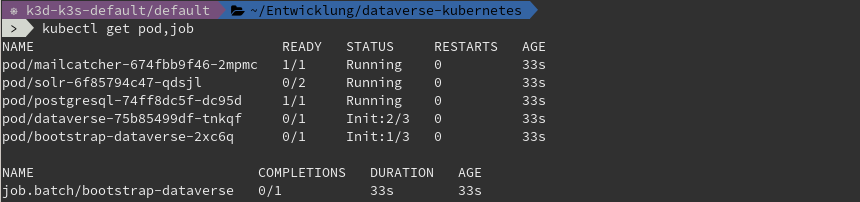
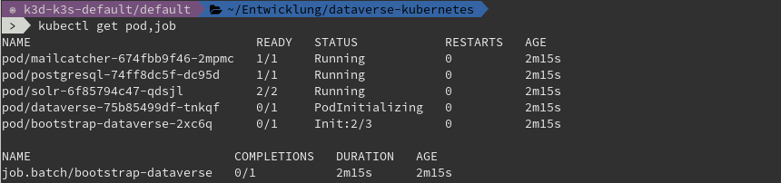
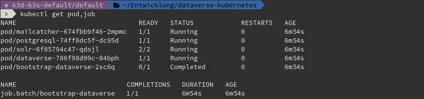

======================
Using *k3s.io* persona
======================

The *k3s.io persona* is about deploying Dataverse to *k3s.io* for **local
development or demo purposes**.

.. seealso::
  `k3s.io <https://k3s.io>`_ is a very small and simplicity first Kubernetes
  distribution, targeted at use cases like (tiny) microservices, continious integration,
  internet of things etc. Compared to *minikube*, *k3s* is even smaller and more lightweight.
  You can run *k3s* on hardware, a virtual machine or in a Docker container.

Start with setup of *k3s.io*
----------------------------

First, setup a single node K3s cluster. As noted above, there are multiple
options for this - one of them, using *k3d* is described below.

As K3s removed all "in-tree" storage classes, you will need to provide
one on your own. For simple purposes like demos or development, local storage
is sufficient.

For getting started quickly, you can use *k3s.io* on *Docker* easily with *k3d*. You'll need:

- `Docker <https://docs.docker.com/install>`_
- `k3d <https://k3d.io/#installation>`_ v3.1+

Now create a small test cluster for this demo:

.. code-block:: shell

  k3d cluster create -p "8080:80@loadbalancer"

.. hint::
  Remember you need to expose the ``Ingress`` port, thus the ``-p "8080:80@loadbalancer"``.
  Ingress will be reachable via http://localhost:8080 later. See also
  `k3d exposing guide <https://k3d.io/usage/guides/exposing_services>`_ for more
  options on exposing ports.

Let's get ready to Dataverse...
-------------------------------

.. important::

  Please be aware that the *k3s.io* persona is using `Kustomize <https://kustomize.io>`_
  to re-use the provided descriptors, but suited for usage with K3s.
  Please ensure having *kubectl* v1.14 or later installed or follow the
  `kubectl installation docs <https://kubernetes.io/docs/tasks/tools/install-kubectl>`_.

Now start to deploy Dataverse plus any necessary services and bootstrap via Kustomize:

.. code-block:: shell

  kubectl apply -k github.com/GlobalDataverseCommunityConsortium/dataverse-kubernetes/personas/demo-k3s

When bootstrapping job finished (see ``kubectl get job,pod`` and logs), you can
"just access" Dataverse. *k3s.io* persona adds an ``Ingress`` route from
your host to the service.

Wait a little longer...

Point your favorite browser to http://localhost:8080 and enjoy your freshly backed Dataverse demo.

.. image:: img/dataverse-localhost-8080.png

.. hint::

  Default login for this demo is ``dataverseAdmin:admin1``. See :doc:`/day1/secrets`.

A word on deployment times
^^^^^^^^^^^^^^^^^^^^^^^^^^
On a 2020 laptop with

- 32 GB RAM,
- SATA SSD,
- Intel Core i7-8665U and
- a fairly fast internet connection for image pulling
- and Docker Hub behaving normal

it takes about **3 to 4 minutes** from zero to hero, not including installation time
for Docker, k3d/k3s or kubectl. Timestamps above differ due to Docker Hub problems.
